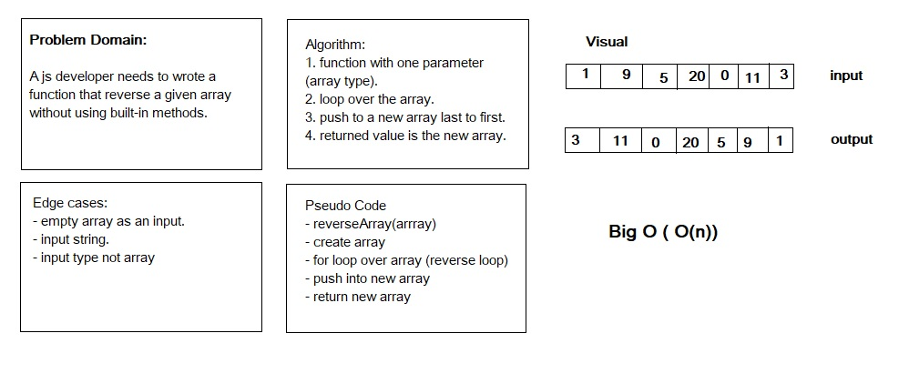
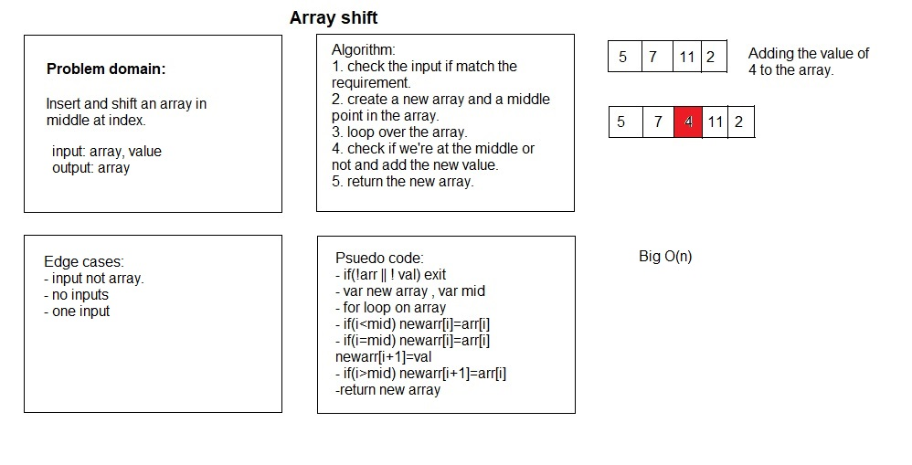

# data-structures-and-algorithms

This repository contains the daily challenges of the 301, 401 courses.

# Documenation for 401 challenges

# Reverse an Array

Arrays and different ways of dealing with arrays data.

## Challenge

a function called reverseArray which takes an array as an argument and return an array with elements in reversed order.

## Approach & Efficiency

Done without utilizing any of the built-in methods available to the language.

## Solution
*check array-reverse folder*

# Array Shift

# Challenge Summary

Insert and shift an array in middle at index.

## Challenge Description

Write a function called insertShiftArray which takes in an array and the value to be added. Without utilizing any of the built-in methods available to your language, return an array with the new value added at the middle index.

## Approach & Efficiency

create an empty array and then loop through the input array a single time. If the index of the input array is before its midpoint (rounded up), the element is added to the new array. If the index is at the midpoint, we add the element and the additional argument value. If the index is after the midpoint, we add the input array value, accounting for the now-different values at each index of the new array and the input array.

## Solution
